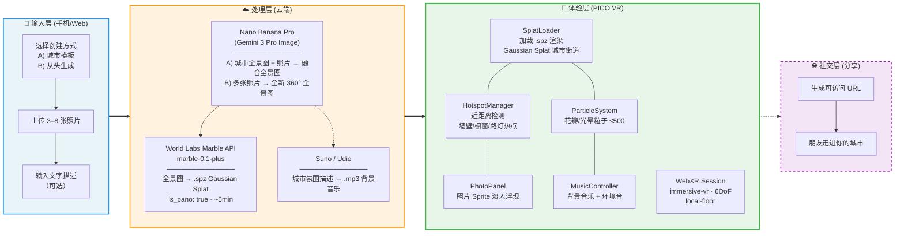

# CityWalk — 技术架构

> 版本：v0.1 · Hackathon Demo 版
> 最后更新：2026-03-13

---

## 一、系统总览



> **Hackathon 简化策略：** 输入层、处理层和社交层（虚线）全部预生成 / fake。Demo 聚焦体验层（粗边框）——评委戴上头显后，走在城市街道上的一切必须是真实运行的。

---

## 二、模块分解

### 2.1 输入层（Hackathon 中跳过）

| 组件 | 说明 | Hackathon 处理 |
|------|------|----------------|
| 创建方式选择 | A) 选择城市模板融入照片 B) 从头生成全新世界 | hardcode 默认城市模板 |
| 照片上传 | 用户从相册选 3–8 张照片 | 预置在项目 `assets/photos/` 中 |

### 2.2 处理层（Hackathon 中预生成）

```
用户照片 (+ 可选城市模板)
    │
    ▼
┌──────────────────────────────────┐
│  Nano Banana Pro                 │
│  (Gemini 3 Pro Image)            │
│                                  │
│  A) 模板模式：                    │
│     城市全景图 + 用户照片 → 融合  │
│     照片嵌入墙壁/橱窗/路灯       │
│                                  │
│  B) 从头生成：                    │
│     多张照片 → 全新 360° 全景图   │
│     照片控制结构，文字控制风格     │
└────────────┬─────────────────────┘
             │ 全景图 (equirectangular PNG)
             ▼
┌─────────────────────────────┐
│  World Labs Marble API      │
│  marble-0.1-plus            │
│  is_pano: true              │
│  ~5 min 生成                │
└────────────┬────────────────┘
             │
     ┌───────┴───────┐
     ▼               ▼
 .spz 文件       .glb 碰撞网格
(Gaussian Splat)  (可选)
```

| 步骤 | 工具 | 输入 | 输出 |
|------|------|------|------|
| 全景图生成 | Nano Banana Pro (Gemini 3 Pro Image) | A) 城市全景图 + 照片 B) 纯照片 + 描述 | 360° 全景图 |
| 世界生成 | Marble API `marble-0.1-plus` | 融合全景图 (`is_pano: true`) | `.spz` (Gaussian Splat) + `.glb` (碰撞网格) |
| 音乐生成 | Suno / Udio | 城市氛围描述 | `.mp3` 背景音乐 |

**Hackathon 处理：** 以上三步全部提前手动完成，产物放入 `assets/` 目录。

### 2.3 体验层（核心实现）

这是 Demo 的全部工程量。运行在 PICO 头显内置浏览器中，零安装。

```
┌─────────────────────────────────────────────────────┐
│                 WebXR 应用 (PICO 浏览器)              │
│                                                      │
│  ┌────────────────────────────────────────────────┐  │
│  │              Three.js Scene                    │  │
│  │                                                │  │
│  │  ┌──────────────┐  ┌────────────────────────┐ │  │
│  │  │ Gaussian     │  │ 氛围层                  │ │  │
│  │  │ Splat 渲染    │  │  · 粒子系统 (花瓣/光晕) │ │  │
│  │  │ (.spz 加载)  │  │  · 背景音乐 + 环境音    │ │  │
│  │  └──────────────┘  └────────────────────────┘ │  │
│  │                                                │  │
│  │  ┌──────────────┐  ┌────────────────────────┐ │  │
│  │  │ 热点系统      │  │ 照片浮现面板            │ │  │
│  │  │ (墙壁/橱窗)  │  │ (Sprite / Plane)       │ │  │
│  │  │ (近距离触发)  │  │                        │ │  │
│  │  └──────────────┘  └────────────────────────┘ │  │
│  └────────────────────────────────────────────────┘  │
│                                                      │
│  ┌────────────────────────────────────────────────┐  │
│  │  WebXR Session (immersive-vr)                  │  │
│  │  · 6DoF 追踪                                   │  │
│  │  · Reference Space: local-floor                │  │
│  └────────────────────────────────────────────────┘  │
└─────────────────────────────────────────────────────┘
```

---

## 三、目录结构

```
citywalk/
├── assets/
│   ├── cities/
│   │   ├── tokyo-shibuya/
│   │   │   ├── world.spz          # Gaussian Splat 文件（融合后）
│   │   │   ├── collision.glb      # 碰撞网格 (可选)
│   │   │   ├── panorama.png       # 融合全景图 (备用)
│   │   │   ├── music.mp3          # 城市氛围音乐
│   │   │   └── config.json        # 热点坐标 + 城市元数据
│   │   └── kyoto-alley/
│   │       └── ...
│   └── photos/
│       ├── shibuya_001.jpg
│       ├── shibuya_002.jpg
│       └── ...
├── src/
│   ├── main.js                    # 入口：初始化 WebXR Session
│   ├── scene/
│   │   ├── SplatLoader.js         # 加载并渲染 .spz Gaussian Splat
│   │   ├── ParticleSystem.js      # 花瓣 / 光晕粒子效果
│   │   └── PhotoPanel.js          # 照片浮现面板 (Sprite 淡入)
│   ├── interaction/
│   │   ├── HotspotManager.js      # 热点注册 + 近距离检测
│   │   └── ProximityTrigger.js    # 每帧距离计算逻辑
│   ├── audio/
│   │   └── MusicController.js     # 背景音乐播放 + 音量渐变
│   └── utils/
│       └── CoordConverter.js      # 经纬度 → 3D 世界坐标转换
├── index.html                     # WebXR 入口页面
├── package.json
└── vite.config.js                 # 开发服务器 + 构建配置
```

---

## 四、核心数据流

### 4.1 城市配置文件 (`config.json`)

每个城市的元数据和热点坐标，手动标注后写入：

```json
{
  "id": "tokyo-shibuya",
  "title": "东京涩谷",
  "description": "涩谷十字路口的夜晚",
  "splat": "world.spz",
  "music": "music.mp3",
  "hotspots": [
    {
      "id": "wall-poster",
      "photo": "shibuya_001.jpg",
      "position": { "x": 2.5, "y": 1.5, "z": -3.0 },
      "triggerRadius": 0.5,
      "label": "涩谷墙壁"
    },
    {
      "id": "shop-window",
      "photo": "shibuya_002.jpg",
      "position": { "x": -1.0, "y": 1.2, "z": 1.5 },
      "triggerRadius": 0.5,
      "label": "拉面店橱窗"
    }
  ]
}
```

### 4.2 运行时数据流

```
每帧循环 (requestAnimationFrame)
    │
    ├─→ 获取 XR 相机位置 (viewer pose)
    │
    ├─→ HotspotManager.update(playerPosition)
    │       │
    │       ├─→ 遍历所有热点，计算距离
    │       │
    │       ├─→ distance < triggerRadius?
    │       │       ├── YES → PhotoPanel.fadeIn(photoId)
    │       │       │         MusicController.raiseVolume()
    │       │       └── NO  → PhotoPanel.fadeOut()
    │       │                 MusicController.lowerVolume()
    │       │
    │
    ├─→ ParticleSystem.update(deltaTime)
    │       └─→ Y 轴正弦动画 + 随机相位 (花瓣飘落)
    │
    └─→ renderer.render(scene, camera)
```

---

## 五、技术栈明细

| 层级 | 技术 | 版本/规格 | 用途 |
|------|------|-----------|------|
| 运行时 | Three.js | latest | 3D 场景渲染 |
| WebXR 框架 | SparkJS 2.0 | SensAI Kit | WebXR session 管理 |
| Splat 渲染 | Three.js Gaussian Splat Loader | - | 加载 `.spz` 文件 |
| 粒子系统 | Three.js `BufferGeometry` + Points | - | 花瓣 / 光晕，≤500 粒子 |
| 照片面板 | Three.js `Sprite` / `PlaneGeometry` | - | 淡入动画浮层 |
| 音频 | Web Audio API | - | 背景音乐 + 环境音播放 |
| 构建工具 | Vite | latest | 开发服务器 + 打包 |
| 运行环境 | PICO 4 内置浏览器 | Android WebView | WebXR `immersive-vr` |
| 备选环境 | Quest 3 浏览器 | - | 现场 Quest 可用 |

### 预生成工具（不在运行时中）

| 工具 | 用途 |
|------|------|
| Nano Banana Pro (Gemini 3 Pro Image) | 模板融合 / 从头生成 360° 全景图 |
| World Labs Marble API (`marble-0.1-plus`) | 融合全景图 → `.spz` Gaussian Splat |
| Suno / Udio | 城市氛围 → 背景音乐 |

---

## 六、性能约束 (PICO 4)

| 指标 | 目标 | 策略 |
|------|------|------|
| 帧率 | ≥ 72 FPS | 粒子数 ≤ 500；无实时光照计算 |
| 内存 | < 2 GB | 单城市单 `.spz`；照片按需加载 |
| 加载时间 | < 10s | 资产本地化 / 预缓存 |
| 网络依赖 | 零 | 所有资产 hardcode，Demo 期间无 API 调用 |

---

## 七、关键交互流程

### 7.1 进入城市

```
用户打开浏览器 URL
    → index.html 加载
    → 默认加载东京涩谷
    → 请求 WebXR immersive-vr session
    → 加载 .spz + config.json + photos + music
    → 渲染 Gaussian Splat 城市街道 + 启动粒子系统
    → 城市环境音 + 音乐淡入
    → 用户自由行走探索街道
```

### 7.2 发现记忆（近距离交互）

```
用户在街道上行走
    → 每帧检测与各热点的距离
    → 走近墙壁/橱窗热点 (< 0.5m)
        → 嵌入的照片从模糊变清晰
        → 原始高清照片以 Sprite 浮现
        → 音乐音量渐强
    → 离开热点 (> 1.0m)
        → 照片淡出
        → 音乐回归基础音量
```

---

## 八、开发计划 (实际 ~14h)

> **现实约束：** Day 2 主要是调试、录视频、social 和颁奖，几乎没有开发时间。所有核心功能必须在 Day 1 完成。非必要功能全部 fake。

### Day 1 — 周六（唯一开发日）

| 时段 | 任务 | 产出 |
|------|------|------|
| 9:00–11:00 | 项目脚手架：Vite + Three.js + WebXR + SparkJS | 可运行的空 WebXR 场景 |
| 11:00–14:00 | `SplatLoader.js`：加载预生成 `.spz` 并渲染 | 头显中可见城市街道 |
| 14:00–17:00 | `HotspotManager.js` + `PhotoPanel.js`：近距离触发 + 照片浮现 | 走近墙壁/橱窗时照片淡入 |
| 17:00–19:00 | `ParticleSystem.js`：花瓣/光晕粒子效果 | 粒子漂浮在街道中 |
| 19:00–23:00 | `MusicController.js`：音乐播放 + 整体联调 | 完整体验闭环 |

### Day 2 — 周日（调试 + 提交）

| 时段 | 任务 |
|------|------|
| 8:00–10:00 | PICO 实机测试 + Bug 修复 |
| 10:00–12:00 | 最终调参 + 录制 45s Demo 视频 |
| **13:00** | **提交截止** |
| 14:00–17:00 | 评审 + Showcase + 颁奖 |

### 砍掉 / Fake 的功能

| 功能 | 处理方式 |
|------|---------|
| 多城市模板选择 | 砍掉，hardcode 默认加载东京涩谷 |
| 手机端上传照片 | Pitch 口头说明 |
| Gemini 实时融合照片到城市 | 融合全景图提前生成好 |
| Marble API 实时生成世界 | `.spz` 提前跑好，hardcode |
| VLM 自动热点定位 | 手动走一遍后写死坐标 |
| 社交分享 / 互相拜访 | 架构图 + 口头 pitch |
| 用户账号 / 云存储 | 架构图口头描述 |
| AI 音乐实时生成 | 音频文件提前生成，静态加载 |

---

## 九、风险缓解

| 风险 | 应对 |
|------|------|
| SparkJS 在 PICO 上渲染 `.spz` 性能不足 | 降低 Splat 分辨率；减少粒子数；必要时切 Quest 3 |
| WebXR session 在 PICO 浏览器中不启动 | 提前测试；备用方案：Quest 3 浏览器（主办方提供） |
| 融合全景图质量差（照片嵌入不自然） | 多组 Prompt 预生成多版本，选最佳 |
| 热点位置与城市场景不匹配 | 世界生成后实际走一遍，手动微调坐标 |
| Demo 现场崩溃 | 零网络依赖、零实时 API、所有资产 hardcode |
