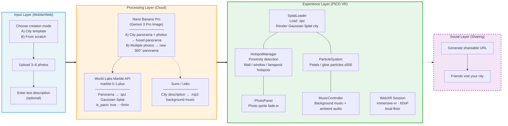

# CityWalk — Technical Architecture

> Version: v0.1 · Hackathon Demo
> Last updated: 2026-03-13

---

## 1. System Overview



> **Hackathon simplification:** The input layer, processing layer, and social layer (dashed) are all pre-generated / faked. The demo focuses entirely on the experience layer (thick border) — everything the judges see after putting on the headset must be real and running live.

---

## 2. Module Breakdown

### 2.1 Input Layer (skipped for Hackathon)

| Component | Description | Hackathon handling |
|-----------|-------------|-------------------|
| Mode selection | A) City template fusion B) Generate from scratch | Hardcoded default city template |
| Photo upload | User selects 3–8 photos from gallery | Pre-placed in `assets/photos/` |

### 2.2 Processing Layer (pre-generated for Hackathon)

```
User photos (+ optional city template)
    │
    ▼
┌──────────────────────────────────┐
│  Nano Banana Pro                 │
│  (Gemini 3 Pro Image)            │
│                                  │
│  Mode A (template):              │
│    City panorama + user photos   │
│    → photos embedded in walls,   │
│      windows, lampposts          │
│                                  │
│  Mode B (from scratch):          │
│    Multiple photos → new 360°    │
│    Photos control structure,     │
│    text controls style           │
└────────────┬─────────────────────┘
             │ panorama (equirectangular PNG)
             ▼
┌─────────────────────────────┐
│  World Labs Marble API      │
│  marble-0.1-plus            │
│  is_pano: true              │
│  ~5 min generation          │
└────────────┬────────────────┘
             │
     ┌───────┴───────┐
     ▼               ▼
 .spz file       .glb collision mesh
(Gaussian Splat)  (optional)
```

| Step | Tool | Input | Output |
|------|------|-------|--------|
| Panorama generation | Nano Banana Pro (Gemini 3 Pro Image) | A) City panorama + photos  B) Photos + description | 360° panorama |
| World generation | Marble API `marble-0.1-plus` | Fused panorama (`is_pano: true`) | `.spz` (Gaussian Splat) + `.glb` (collision mesh) |
| Music generation | Suno / Udio | City description | `.mp3` background music |

**Hackathon handling:** All three steps are completed manually in advance. Output is placed in `assets/`.

### 2.3 Experience Layer (core implementation)

This is the entire engineering scope of the demo. Runs inside the PICO headset browser, zero install required.

```
┌─────────────────────────────────────────────────────┐
│              WebXR App (PICO browser)               │
│                                                     │
│  ┌───────────────────────────────────────────────┐  │
│  │             Three.js Scene                    │  │
│  │                                               │  │
│  │  ┌──────────────┐  ┌───────────────────────┐  │  │
│  │  │ Gaussian     │  │ Atmosphere layer       │  │  │
│  │  │ Splat render │  │  · Particle system     │  │  │
│  │  │ (.spz load)  │  │  · Music + ambient     │  │  │
│  │  └──────────────┘  └───────────────────────┘  │  │
│  │                                               │  │
│  │  ┌──────────────┐  ┌───────────────────────┐  │  │
│  │  │ Hotspot      │  │ Photo reveal panel     │  │  │
│  │  │ system       │  │ (Sprite / Plane)       │  │  │
│  │  │ (proximity)  │  │                        │  │  │
│  │  └──────────────┘  └───────────────────────┘  │  │
│  └───────────────────────────────────────────────┘  │
│                                                     │
│  ┌───────────────────────────────────────────────┐  │
│  │  WebXR Session (immersive-vr)                 │  │
│  │  · 6DoF tracking                              │  │
│  │  · Reference space: local-floor               │  │
│  └───────────────────────────────────────────────┘  │
└─────────────────────────────────────────────────────┘
```

---

## 3. Directory Structure

```
citywalk/
├── assets/
│   ├── cities/
│   │   ├── tokyo-shibuya/
│   │   │   ├── world.spz          # Gaussian Splat (fused)
│   │   │   ├── collision.glb      # Collision mesh (optional)
│   │   │   ├── panorama.png       # Fused panorama (fallback)
│   │   │   ├── music.mp3          # City atmosphere music
│   │   │   └── config.json        # Hotspot coordinates + city metadata
│   │   └── kyoto-alley/
│   │       └── ...
│   └── photos/
│       ├── shibuya_001.jpg
│       ├── shibuya_002.jpg
│       └── ...
├── src/
│   ├── main.js                    # Entry: initialize WebXR session
│   ├── scene/
│   │   ├── SplatLoader.js         # Load and render .spz Gaussian Splat
│   │   ├── ParticleSystem.js      # Petal / glow particle effects
│   │   └── PhotoPanel.js          # Photo reveal panel (Sprite fade-in)
│   ├── interaction/
│   │   ├── HotspotManager.js      # Hotspot registration + proximity detection
│   │   └── ProximityTrigger.js    # Per-frame distance calculation
│   ├── audio/
│   │   └── MusicController.js     # Background music playback + volume fade
│   └── utils/
│       └── CoordConverter.js      # Lat/lon → 3D world coordinates
├── index.html                     # WebXR entry page
├── package.json
└── vite.config.js                 # Dev server + build config
```

---

## 4. Core Data Flow

### 4.1 City config file (`config.json`)

Metadata and hotspot coordinates for each city, manually annotated:

```json
{
  "id": "tokyo-shibuya",
  "title": "Tokyo Shibuya",
  "description": "Shibuya crossing at night",
  "splat": "world.spz",
  "music": "music.mp3",
  "hotspots": [
    {
      "id": "wall-poster",
      "photo": "shibuya_001.jpg",
      "position": { "x": 2.5, "y": 1.5, "z": -3.0 },
      "triggerRadius": 0.5,
      "label": "Shibuya wall"
    },
    {
      "id": "shop-window",
      "photo": "shibuya_002.jpg",
      "position": { "x": -1.0, "y": 1.2, "z": 1.5 },
      "triggerRadius": 0.5,
      "label": "Ramen shop window"
    }
  ]
}
```

### 4.2 Runtime data flow

```
Per-frame loop (requestAnimationFrame)
    │
    ├─→ Get XR camera position (viewer pose)
    │
    ├─→ HotspotManager.update(playerPosition)
    │       │
    │       ├─→ Iterate all hotspots, compute distance
    │       │
    │       ├─→ distance < triggerRadius?
    │       │       ├── YES → PhotoPanel.fadeIn(photoId)
    │       │       │         MusicController.raiseVolume()
    │       │       └── NO  → PhotoPanel.fadeOut()
    │       │                 MusicController.lowerVolume()
    │
    ├─→ ParticleSystem.update(deltaTime)
    │       └─→ Y-axis sine animation + random phase (petal drift)
    │
    └─→ renderer.render(scene, camera)
```

---

## 5. Tech Stack

| Layer | Technology | Version / Spec | Purpose |
|-------|-----------|----------------|---------|
| Runtime | Three.js | latest | 3D scene rendering |
| WebXR framework | SparkJS 2.0 | SensAI Kit | WebXR session management |
| Splat rendering | Three.js Gaussian Splat Loader | - | Load `.spz` files |
| Particle system | Three.js `BufferGeometry` + Points | - | Petals / glow, ≤500 particles |
| Photo panel | Three.js `Sprite` / `PlaneGeometry` | - | Fade-in overlay |
| Audio | Web Audio API | - | Background music + ambient audio |
| Build tool | Vite | latest | Dev server + bundling |
| Runtime env | PICO 4 built-in browser | Android WebView | WebXR `immersive-vr` |
| Fallback env | Quest 3 browser | - | On-site Quest available |

### Pre-generation tools (not in runtime)

| Tool | Purpose |
|------|---------|
| Nano Banana Pro (Gemini 3 Pro Image) | Template fusion / generate 360° panorama from scratch |
| World Labs Marble API (`marble-0.1-plus`) | Fused panorama → `.spz` Gaussian Splat |
| Suno / Udio | City atmosphere → background music |

---

## 6. Performance Targets (PICO 4)

| Metric | Target | Strategy |
|--------|--------|---------|
| Frame rate | ≥ 72 FPS | Particles ≤ 500; no real-time lighting |
| Memory | < 2 GB | Single `.spz` per city; photos loaded on demand |
| Load time | < 10s | Assets local / pre-cached |
| Network dependency | Zero | All assets hardcoded, no API calls during demo |

---

## 7. Key Interaction Flows

### 7.1 Entering the city

```
User opens browser URL
    → index.html loads
    → Default city (Tokyo Shibuya) loaded
    → Request WebXR immersive-vr session
    → Load .spz + config.json + photos + music
    → Render Gaussian Splat city + start particle system
    → Ambient audio + music fade in
    → User freely walks and explores
```

### 7.2 Discovering a memory (proximity interaction)

```
User walks down the street
    → Per-frame distance check against all hotspots
    → Approaches wall / window hotspot (< 0.5m)
        → Embedded photo sharpens from blur
        → Original hi-res photo appears as Sprite overlay
        → Music volume rises
    → Leaves hotspot (> 1.0m)
        → Photo fades out
        → Music returns to base volume
```

---

## 8. Development Schedule (~14h total)

> **Reality constraint:** Day 2 is mostly debugging, video recording, social, and awards. All core features must be done on Day 1. Non-essential features are all faked.

### Day 1 — Saturday (the only real dev day)

| Time | Task | Deliverable |
|------|------|-------------|
| 9:00–11:00 | Project scaffold: Vite + Three.js + WebXR + SparkJS | Empty WebXR scene running |
| 11:00–14:00 | `SplatLoader.js`: load and render pre-generated `.spz` | City street visible in headset |
| 14:00–17:00 | `HotspotManager.js` + `PhotoPanel.js`: proximity trigger + photo reveal | Photo fade-in when approaching wall/window |
| 17:00–19:00 | `ParticleSystem.js`: petal/glow particle effects | Particles floating in street |
| 19:00–23:00 | `MusicController.js`: music playback + full integration | Complete experience loop |

### Day 2 — Sunday (debug + submit)

| Time | Task |
|------|------|
| 8:00–10:00 | PICO device testing + bug fixes |
| 10:00–12:00 | Final tuning + record 45s demo video |
| **1:00 PM** | **Submission deadline** |
| 2:00–5:00 PM | Judging + Showcase + Awards |

### Cut / Faked Features

| Feature | Handling |
|---------|---------|
| Multi-city template selection | Cut — hardcode default Tokyo Shibuya |
| Mobile photo upload | Mentioned verbally during pitch |
| Real-time Gemini photo fusion | Fused panorama pre-generated |
| Real-time Marble world generation | `.spz` pre-generated and hardcoded |
| VLM auto hotspot positioning | Manual coordinate annotation after walkthrough |
| Social sharing / visiting | Architecture diagram + verbal pitch |
| User accounts / cloud storage | Architecture diagram verbal description |
| AI music real-time generation | Audio file pre-generated, static load |

---

## 9. Risk Mitigation

| Risk | Mitigation |
|------|-----------|
| SparkJS `.spz` render performance insufficient on PICO | Lower splat resolution; reduce particle count; fall back to Quest 3 if needed |
| WebXR session fails to start in PICO browser | Pre-test on device; fallback: Quest 3 browser (provided by organizers) |
| Fused panorama quality poor (photos look unnatural) | Pre-generate multiple prompt variations, pick the best |
| Hotspot positions don't match the city scene | Walk through generated world after creation, manually fine-tune coordinates |
| Demo crashes on-site | Zero network dependency, zero real-time API calls, all assets hardcoded |
